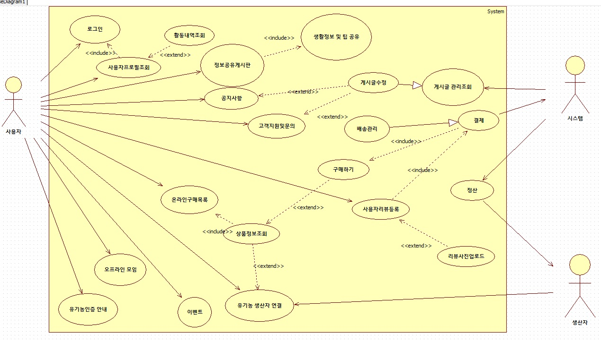

# Green Oasis

## 개요
**Green Oasis**는 유기농 제품 소비자 커뮤니티 플랫폼으로, 유기농 제품 정보, 레시피, 구매 후기를 공유합니다. 유기농 제품과 레시피, 생산자 정보를 신뢰성 있게 연결하고, 커뮤니티 활동을 통해 지속적인 친환경 소비를 촉진합니다.

## 핵심 가치
- **신뢰**: 인증 및 출처 표시를 통해 사용자 간의 신뢰를 구축합니다.
- **편의**: 레시피와 제품 간의 연동으로 간편한 소비 경험을 제공합니다.
- **참여**: 챌린지, 후기, 이벤트를 통해 사용자 참여를 유도합니다.
- **지속성**: 구독 서비스와 포인트 시스템을 통해 지속 가능한 소비를 지원합니다.

## 주요 기능
1. **유기농 제품 정보 공유 게시판**
   - 사용자들끼리 유기농 제품에 대한 정보를 공유하고 토론할 수 있는 공간입니다.

2. **유기농 생산자 연결**
   - 생산자와 소비자를 연결하여 직거래 기회를 제공합니다.
   - 생산자 정보(농장, 제품, 유기농 인증마크 등)를 확인할 수 있습니다.

   2-1. **생산자 프로필 페이지**
   - 생산자의 스토리 영상 및 사진을 제공하여 신뢰를 강화합니다.
   - 농장 일상 브이로그 및 인터뷰 영상을 통해 소비자가 농부의 철학과 과정을 직접 볼 수 있습니다.

3. **유기농 생활 정보 및 팁 공유**
   - 친환경 세제, 화장품 등 유기농 생활 방식에 대한 정보를 공유합니다.
   - 일상생활에서 실천할 수 있는 유기농 팁을 제공합니다.

4. **유기농 이벤트 및 오프라인 모임 안내**
   - 유기농 박람회, 농장 방문 등의 이벤트 정보를 제공합니다.
   - 오프라인 모임을 통해 유기농 커뮤니티를 활성화합니다.
   - 유기농 구매 지원 기능도 포함됩니다.

5. **유기농 제품 온라인 구매 기능 제공**
   - 유기농 제품 구독 서비스를 운영합니다.
   - 유기농 관련 정책 및 인증 정보를 제공합니다.

   5-1. **레시피 + 장바구니 기능**
   - 레시피에 필요한 재료를 클릭하면 해당 유기농 제품 구매 페이지로 이동합니다.
   - 레시피 재료를 한 번에 장바구니에 담을 수 있는 기능을 제공합니다.

6. **유기농 관련 정부 정책 및 인증 기준 정보 제공**
   - 유기농 인증 제도 및 프로세스를 안내합니다.

7. **맞춤형 제품 추천**
   - MBTI 및 취향 기반 추천 기능을 통해 사용자가 선호하는 제품 카테고리나 라이프스타일에 맞춘 제품을 추천합니다.

8. **소비 이력 기반 AI 추천**
   - 사용자가 많이 본 제품 및 레시피를 바탕으로 비슷한 제품을 제안합니다.

9. **지속 가능성 지수 / 친환경 포인트**
   - 각 제품에 탄소 발자국 및 친환경 점수를 표시합니다.
   - 사용자가 친환경 구매 및 활동을 통해 그린 포인트를 적립하고, 이를 할인이나 기부에 사용할 수 있습니다.

10. **커뮤니티 챌린지**
    - "한 달 동안 플라스틱 줄이기", "비건 요리 5일 챌린지" 등 다양한 미션을 진행합니다.
    - 챌린지 달성 시 배지를 지급하며, 랭킹 시스템을 운영합니다.

## 결론
Green Oasis는 유기농 제품과 관련된 정보 공유 및 커뮤니티 활동을 통해 지속 가능한 소비 문화를 형성하는 것을 목표로 합니다. 사용자들이 신뢰할 수 있는 정보를 바탕으로 친환경 소비를 실천할 수 있도록 지원합니다.

