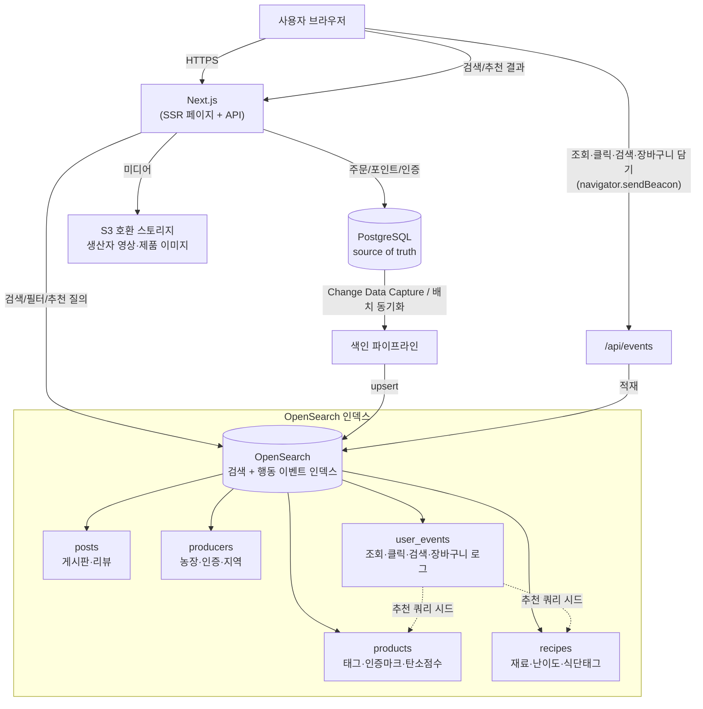
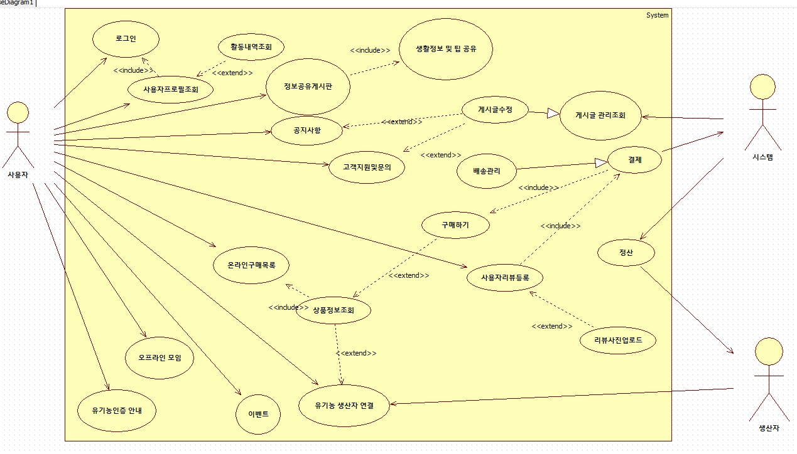

# Green Oasis

## 개요
**Green Oasis**는 유기농 제품 소비자 커뮤니티 플랫폼으로, 유기농 제품 정보, 레시피, 구매 후기를 공유합니다. 유기농 제품과 레시피, 생산자 정보를 신뢰성 있게 연결하고, 커뮤니티 활동을 통해 지속적인 친환경 소비를 촉진합니다.

## 핵심 가치
- **신뢰**: 인증 및 출처 표시를 통해 사용자 간의 신뢰를 구축합니다.
- **편의**: 레시피와 제품 간의 연동으로 간편한 소비 경험을 제공합니다.
- **참여**: 챌린지, 후기, 이벤트를 통해 사용자 참여를 유도합니다.
- **지속성**: 구독 서비스와 포인트 시스템을 통해 지속 가능한 소비를 지원합니다.

## 주요 기능
1. **유기농 제품 정보 공유 게시판**
   - 사용자들끼리 유기농 제품에 대한 정보를 공유하고 토론할 수 있는 공간입니다.

2. **유기농 생산자 연결**
   - 생산자와 소비자를 연결하여 직거래 기회를 제공합니다.
   - 생산자 정보(농장, 제품, 유기농 인증마크 등)를 확인할 수 있습니다.

   2-1. **생산자 프로필 페이지**
   - 생산자의 스토리 영상 및 사진을 제공하여 신뢰를 강화합니다.
   - 농장 일상 브이로그 및 인터뷰 영상을 통해 소비자가 농부의 철학과 과정을 직접 볼 수 있습니다.

3. **유기농 생활 정보 및 팁 공유**
   - 친환경 세제, 화장품 등 유기농 생활 방식에 대한 정보를 공유합니다.
   - 일상생활에서 실천할 수 있는 유기농 팁을 제공합니다.

4. **유기농 이벤트 및 오프라인 모임 안내**
   - 유기농 박람회, 농장 방문 등의 이벤트 정보를 제공합니다.
   - 오프라인 모임을 통해 유기농 커뮤니티를 활성화합니다.
   - 유기농 구매 지원 기능도 포함됩니다.

5. **유기농 제품 온라인 구매 기능 제공**
   - 유기농 제품 구독 서비스를 운영합니다.
   - 유기농 관련 정책 및 인증 정보를 제공합니다.

   5-1. **레시피 + 장바구니 기능**
   - 레시피에 필요한 재료를 클릭하면 해당 유기농 제품 구매 페이지로 이동합니다.
   - 레시피 재료를 한 번에 장바구니에 담을 수 있는 기능을 제공합니다.

6. **유기농 관련 정부 정책 및 인증 기준 정보 제공**
   - 유기농 인증 제도 및 프로세스를 안내합니다.

7. **맞춤형 제품 추천**
   - 건강상태 및 취향 기반 추천 기능을 통해 사용자가 선호하는 제품 카테고리나 라이프스타일에 맞춘 제품을 추천합니다.

8. **소비 이력 기반 AI 추천**
   - 사용자가 많이 본 제품 및 레시피를 바탕으로 비슷한 제품을 제안합니다.

9. **지속 가능성 지수 / 친환경 포인트**
   - 각 제품에 탄소 발자국 및 친환경 점수를 표시합니다.
   - 사용자가 친환경 구매 및 활동을 통해 그린 포인트를 적립하고, 이를 할인이나 기부에 사용할 수 있습니다.

10. **커뮤니티 챌린지**
    - "한 달 동안 플라스틱 줄이기", "비건 요리 5일 챌린지" 등 다양한 미션을 진행합니다.
    - 챌린지 달성 시 배지를 지급하며, 랭킹 시스템을 운영합니다.

---

## 문제 → 선택 → 결과

**문제.** 유기농 정보는 게시판·블로그·생산자 페이지·정책 문서 등 여러 형태로 흩어져 있고, 제품·레시피·생산자가 서로 참조 관계를 가진다. 단순 키워드 매칭으로는 "글루텐프리 비건 레시피에 쓸 수 있는 인증 유기농 재료" 같은 복합 조건을 걸러낼 수 없고, 신규 사용자에게는 취향 기반 추천이, 재방문 사용자에게는 소비 이력 기반 추천이 필요해 추천 로직 자체가 검색과 분리되기 어렵다.

**선택.** 트랜잭션 데이터(주문, 포인트, 인증 정보)는 PostgreSQL이 source of truth로 유지하고, 검색·필터·추천처럼 읽기 위주이면서 스키마가 자주 바뀌는 영역은 **OpenSearch**로 분리한다. 제품·레시피·게시글·생산자를 하나의 검색 계층에서 다루면 "재료 → 레시피 → 제품 → 생산자"로 이어지는 연관 탐색과, 태그·인증마크·탄소점수 같은 다차원 필터를 같은 질의 안에서 조합할 수 있다.

**결과.** 게시판/레시피/제품/생산자 검색이 하나의 인덱스 계층에서 통합되고, MBTI·취향 기반 추천과 소비 이력 기반 추천이 같은 OpenSearch 클러스터 위에서 `more_like_this`·집계 쿼리로 구현된다. Elasticsearch 대비 Apache 2.0 라이선스로 자체 호스팅과 AWS 관리형(Amazon OpenSearch Service) 전환 모두 부담이 없다.

---

## 기술 스택 & 선택 이유

| 영역 | 기술 | 선택 이유 |
|------|------|-----------|
| **프론트엔드** | Next.js (App Router) + React | 게시판·레시피·제품 페이지는 SSR로 SEO 확보, 장바구니·추천 위젯은 클라이언트 인터랙션 |
| **백엔드 API** | Next.js Route Handlers / Node.js | 프론트와 동일 레포에서 서버 로직 관리, 인증·주문 등 트랜잭션 처리 |
| **주 데이터베이스** | PostgreSQL | 사용자, 주문, 포인트, 인증·정책 정보 등 정합성이 중요한 관계형 데이터의 source of truth |
| **검색·추천 엔진** | **OpenSearch** | 게시판/레시피/제품/생산자 통합 검색, 다차원 필터(태그·인증·탄소점수), 취향·이력 기반 추천을 하나의 계층에서 처리. Apache 2.0 라이선스로 벤더 종속 없이 자체 호스팅·관리형 서비스 전환 자유 |
| **미디어 저장소** | S3 호환 오브젝트 스토리지 | 생산자 스토리 영상·브이로그, 제품 이미지 저장 및 CDN 배포 |
| **캐시** | Redis (선택) | 랭킹·챌린지 리더보드, 실시간 그린 포인트 집계 캐싱 |
| **행동 이벤트 수집** | 클라이언트 beacon(`navigator.sendBeacon`) → Next.js API Route → OpenSearch | 별도 로깅 인프라(Kafka 등) 없이, 검색에 쓰는 OpenSearch 클러스터에 이벤트 인덱스를 추가하는 방식으로 시작 — 트래픽이 커지면 Data Prepper/Kafka로 수집 단계만 교체 가능 |

---

## 아키텍처


```mermaid
graph TD
    User["사용자 브라우저"] -->|HTTPS| Next["Next.js\n(SSR 페이지 + API)"]

    Next -->|주문/포인트/인증| PG[("PostgreSQL\nsource of truth")]
    Next -->|검색/필터/추천 질의| OS[("OpenSearch\n검색 + 행동 이벤트 인덱스")]
    Next -->|미디어| S3["S3 호환 스토리지\n생산자 영상·제품 이미지"]

    PG -->|Change Data Capture / 배치 동기화| Indexer["색인 파이프라인"]
    Indexer -->|upsert| OS

    User -->|"조회·클릭·검색·장바구니 담기\n(navigator.sendBeacon)"| EventAPI["/api/events"]
    EventAPI -->|적재| OS

    subgraph "OpenSearch 인덱스"
        OS --> IdxProduct["products\n태그·인증마크·탄소점수"]
        OS --> IdxRecipe["recipes\n재료·난이도·식단태그"]
        OS --> IdxPost["posts\n게시판·리뷰"]
        OS --> IdxProducer["producers\n농장·인증·지역"]
        OS --> IdxEvents["user_events\n조회·클릭·검색·장바구니 로그"]
    end

    IdxEvents -.->|"추천 쿼리 시드"| IdxProduct
    IdxEvents -.->|"추천 쿼리 시드"| IdxRecipe

    User -->|"검색/추천 결과"| Next
```

**데이터 흐름 원칙**: PostgreSQL이 쓰기 기준(source of truth)이며, 상품·레시피·게시글·생산자 데이터가 생성·수정될 때마다 색인 파이프라인이 해당 문서를 OpenSearch에 upsert한다. 검색·추천·필터링은 항상 OpenSearch를 통해서만 조회하고, 주문·결제·포인트 같은 트랜잭션은 PostgreSQL을 직접 조회한다. 사용자 행동(조회·클릭·검색·장바구니 담기)은 별도의 쓰기 경로로 `user_events` 인덱스에 직접 쌓이며, 이 로그가 추천 쿼리의 입력이 된다.

---

## 사용자 행동 추적 → 추천 파이프라인

**문제.** 소비 이력 기반 추천(기능 8)은 "무엇을 봤고 클릭했는지"를 알아야 작동한다. 주문 이력만 신호로 쓰면 표본이 너무 적다 — 대부분의 방문자는 둘러보기만 하고 구매까지 가지 않는다. 취향 기반 추천(기능 7)도 초기 설문만으로는 시간이 지나며 실제 관심사와 어긋난다.

**선택.** 조회·클릭·검색·장바구니 담기 같은 저-신뢰(low-intent) 행동까지 이벤트로 수집해 OpenSearch `user_events` 인덱스에 적재한다. OpenSearch는 원래 로그·이벤트 적재·집계에 최적화된 엔진이므로, 검색용 인덱스와 행동 로그 인덱스를 같은 클러스터에서 운영해도 별도 분석 인프라가 필요 없다.

이벤트 스키마 예시:

```json
{
  "userId": "u_123",
  "sessionId": "s_abc",
  "eventType": "product_view | product_click | search | cart_add | challenge_join",
  "targetId": "product_456",
  "targetType": "product | recipe | post | producer",
  "query": "글루텐프리 비건",
  "timestamp": "2026-07-13T10:00:00Z"
}
```

**흐름**: 사용자가 제품을 조회·클릭하거나 검색어를 입력하면 클라이언트가 `navigator.sendBeacon`으로 `/api/events`에 비동기 전송 → `user_events` 인덱스에 적재. 추천 시점에는 해당 사용자의 최근 이벤트에서 `targetId`를 시드로 뽑아 `products`/`recipes` 인덱스에 `more_like_this` 쿼리를 실행한다. `eventType=search` 로그는 인기 검색어·자동완성 개선에도 재사용한다.

**결과.** 회원가입 직후에는 MBTI/취향 태그 기반 추천(기능 7)으로 시작하고, 행동 이벤트가 쌓일수록 소비 이력 기반 추천(기능 8)의 비중을 높이는 콜드스타트 전환이 자연스럽게 이어진다.

---

## OpenSearch 적용 상세

| 기능 | OpenSearch 활용 방식 |
|------|----------------------|
| **통합 검색** (기능 1, 3) | 게시판·생활정보 게시글을 `posts` 인덱스에 색인. 한국어 형태소 분석기(Nori)로 "유기농 세제 추천" 같은 자연어 검색 지원 |
| **레시피 ↔ 제품 연동 검색** (기능 5-1) | `recipes` 인덱스의 재료 필드와 `products` 인덱스를 조인 없이 애플리케이션 레벨에서 매칭 — 재료 클릭 시 해당 재료명으로 `products` 검색 질의 실행 |
| **생산자 필터 검색** (기능 2, 2-1) | `producers` 인덱스에 인증마크·지역·품목을 필터 필드로 색인, 다중 조건 필터링(예: "무농약 인증 + 경기도 + 채소류") |
| **맞춤형 제품 추천** (기능 7) | 사용자 취향/건강상태 태그를 쿼리 조건으로 `products` 인덱스에 `bool` + `function_score` 쿼리 적용, 태그 일치도에 가중치 부여 |
| **소비 이력 기반 추천** (기능 8) | `user_events` 인덱스에 쌓인 조회·클릭·구매 이력을 시드로 `more_like_this` 쿼리 실행해 유사 제품·레시피 추천 (자세한 흐름은 [사용자 행동 추적 → 추천 파이프라인](#사용자-행동-추적--추천-파이프라인) 참고) |
| **지속가능성 지수 정렬/필터** (기능 9) | `products` 인덱스에 탄소 발자국·친환경 점수를 숫자 필드로 색인, range 필터 + 정렬로 "친환경 점수 상위" 노출 |
| **챌린지 랭킹** (기능 10) | 그린 포인트 적립 이력을 집계(aggregation) 쿼리로 실시간 리더보드 산출 |

---

## 결론
Green Oasis는 유기농 제품과 관련된 정보 공유 및 커뮤니티 활동을 통해 지속 가능한 소비 문화를 형성하는 것을 목표로 합니다. PostgreSQL이 정합성이 중요한 트랜잭션 데이터를 책임지고, OpenSearch가 게시판·레시피·제품·생산자를 넘나드는 검색과 추천을 책임지는 역할 분리를 통해, 사용자들이 신뢰할 수 있는 정보를 빠르게 찾고 친환경 소비를 실천할 수 있도록 지원합니다.


